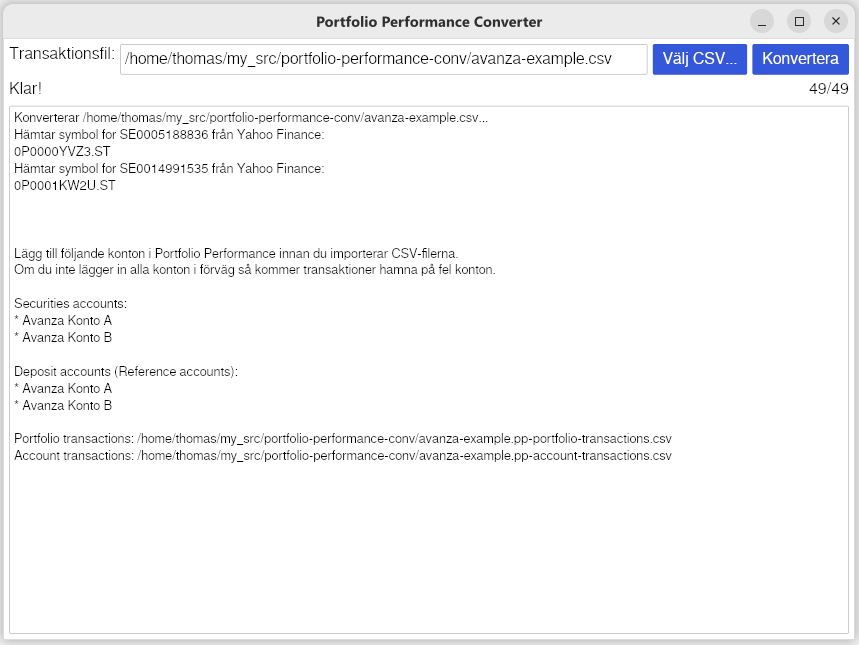

# Portfolio Performance Converter

A project to learn Rust and to convert CSV files from banks into [Portfolio Performance](https://www.portfolio-performance.info/) CSV format, for when the built-in conversions are not enough.

## Ladda ner

Hämta den senaste versionen under [Releases](https://github.com/thomasa88/portfolio-performance-conv/releases/latest). Välj exe-filen för Windows och filen utan filländelse för Linux.

## Avanza

Ladda ner din transaktioner från Avanza under *Min ekonomi -> Transaktioner -> [Set date range] -> Exportera transaktioner*.

Kör konverteringsprogrammet och välj filen. Alternativt kan programmet köras i en terminal genom att ange filen som argument. De konverterade filerna hamnar i samma mapp som originalfilen.

Skapa de listade kontona i Portfolio Performance.

Importera de konverterade filerna under *File -> Import -> CSV files* some *portfolio transactions* respektive *account transactions*.